# Unit Testing with Pytest

> Introduction to Unit Testing using Pytest

---

## Table of Contents

1. [Introduction](#1-introduction)
2. [Project Setup](#2-project-setup)
3. [Writing Tests — Functions and Classes](#3-writing-tests--functions-and-classes)
4. [Filtering Tests](#4-filtering-tests)
5. [Providing Multiple Test Cases](#5-providing-multiple-test-cases)
6. [Parametrizing with Data Classes](#6-parametrizing-with-data-classes)
7. [Testing Exception Handling](#7-testing-exception-handling)
8. [Fixtures](#8-fixtures)
9. [Extending Pytest with Plugins](#9-extending-pytest-with-plugins)
10. [Summary](#10-summary)

---

## 1. Introduction

Unit tests are the type of tests where each component of the program is tested on its own. In
other words, one doesn't have to run the entire software and analyze its output manually but just
run unit tests that will feed certain input values to a function and check if the output is as
expected.
For the purpose of this exercise , I chose to test a simple function that would transform raw byte
values into strings of KB, MB, and GB units such as `1.00 MB` and `3.50 GB`. Having a concrete
example rather than abstract code definitely helped me understand better the notions discussed
above.
The testing library used is Pytest , the most common testing library for writing Python unit tests.
One of the advantages of this library is that it automatically finds tests and provides informative
error messages, among others.

---

## 2. Project Setup

Before writing any tests, set up the project directory with a specific structure. Source code lives under `src/`, test files go in a separate `tests/` directory, and a `pytest.ini` file at the root tells Pytest where to look.

```
PYTEST-DEMO/
├── .pytest_cache/
├── src/
│   ├── __pycache__/
│   ├── __init__.py
│   └── formatter.py
├── tests/
│   ├── __pycache__/
│   ├── test_database_fixture.py
│   ├── test_format_file_size_with_fixtures.py
│   ├── test_format_file_size.py
│   └── test_formatter.py
├── venv/
├── .gitignore
├── main.py
├── pyvenv.cfg
└── pytest.ini
```

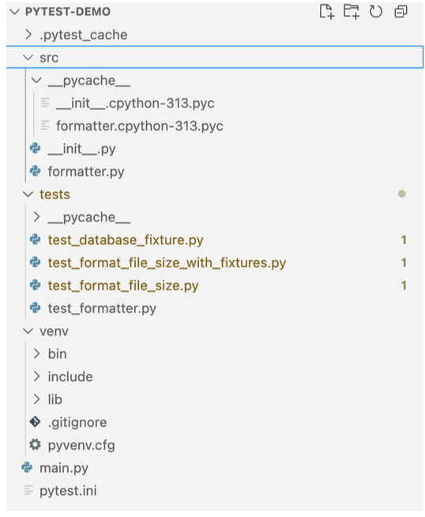

The `formatter.py` file contains the function being tested:


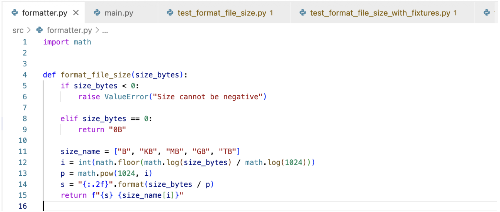

To run any tests, Pytest must first be installed and invoked from the terminal:

```bash
pip install pytest
pytest
```

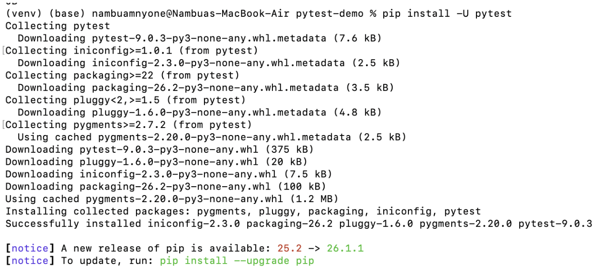

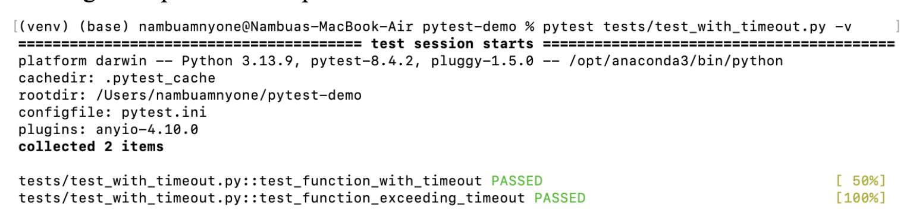

---

## 3. Writing Tests — Functions and Classes

### 3.1 Naming Conventions

Pytest discovers tests automatically based on naming. The rules are:

- **Test files** must start with `test_` (e.g., `test_formatter.py`)
- **Test functions** must start with `test_` (e.g., `test_format_file_size_returns_format_mb`)
- **Test classes** must start with `Test` (capitalized), and their methods must also start with `test_`

Descriptive names matter. A name like `test_format_file_size_returns_format_kb` immediately communicates what scenario is being verified , which  useful when a test fails and you need to know what broke.

```python
# Example of a class-based test structure
class TestFormatFileSize:
    def test_format_file_size_returns_gb_format(self):
        assert format_file_size(1024**3) == "1.00 GB"
```
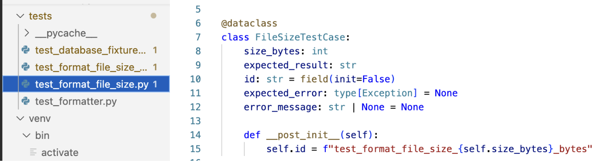
---

## 4. Filtering Tests

Running the full test suite on every change gets slow as a project grows. Pytest provides several ways to run a targeted subset.

**Run tests in a specific file:**
```bash
pytest tests/test_format_file_size.py
```

**Run a specific test function:**
```bash
pytest tests/test_format_file_size.py::test_format_file_size_returns_format_tb
```
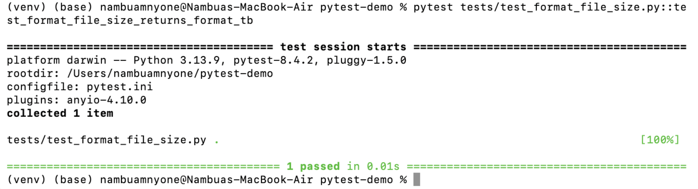

**Run a specific method within a class:**
```bash
pytest tests/test_file.py::TestClassName::test_method
```

**Filter by substring using `-k`:**
```bash
pytest -k mb
```

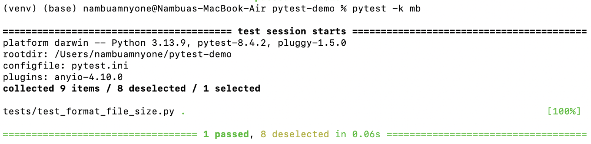

This runs only tests whose names contain the string `mb` — in this case, `test_format_file_size_returns_format_mb`.


**Exclude tests by substring:**
```bash
pytest -k "not gb and not mb" -v
```

The `-v` flag (verbose) prints each test name individually so you can confirm which ones ran.

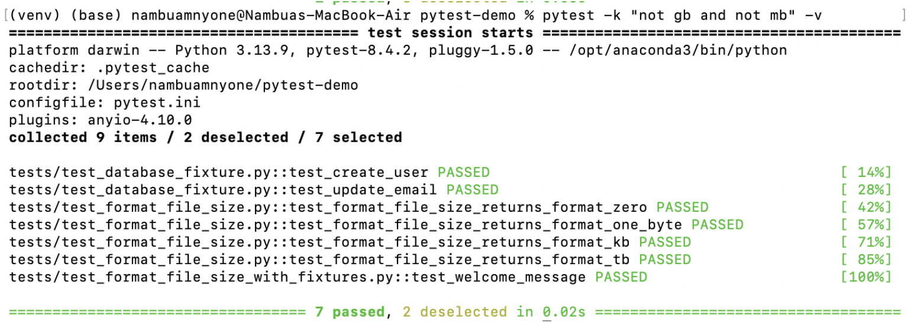
---

## 5. Providing Multiple Test Cases

### 5.1 The Problem with Repetitive Functions

When testing one function across many inputs, writing a separate function for each case gets repetitive:

```python
from src.formatter import format_file_size

def test_format_file_size_returns_format_zero():
    assert format_file_size(0) == "0B"


def test_format_file_size_returns_format_one_byte():
    assert format_file_size(1) == "1.00 B"


def test_format_file_size_returns_format_kb():
    assert format_file_size(1024) == "1.00 KB"


def test_format_file_size_returns_format_mb():
    assert format_file_size(1024**2) == "1.00 MB"


def test_format_file_size_returns_format_gb():
    assert format_file_size(1024**3) == "1.00 GB"


def test_format_file_size_returns_format_tb():
    assert format_file_size(1024**4) == "1.00 TB"
```


The structure is identical — only the inputs and expected values differ.

### 5.2 Using `@pytest.mark.parametrize`

Pytest's `parametrize` decorator collapses all those cases into a single function:


```python
import pytest
from src.formatter import format_file_size

@pytest.mark.parametrize(
    "size_bytes, expected_result",
    [
        (0, "0B"),
        (1, "1.00 B"),
        (1024, "1.00 KB"),
        (1024**2, "1.00 MB"),
        (1024**3, "1.00 GB"),
        (1024**4, "1.00 TB"),
    ],
)
def test_format_file_size(size_bytes, expected_result):
    assert format_file_size(size_bytes) == expected_result
```

Pytest treats each tuple as a separate test case and assigns it a unique ID automatically. Running with `-v` shows them individually:

```
tests/test_format_file_size.py::test_format_file_size[0-0B] PASSED
tests/test_format_file_size.py::test_format_file_size[1-1.00 B] PASSED
tests/test_format_file_size.py::test_format_file_size[1024-1.00 KB] PASSED
```

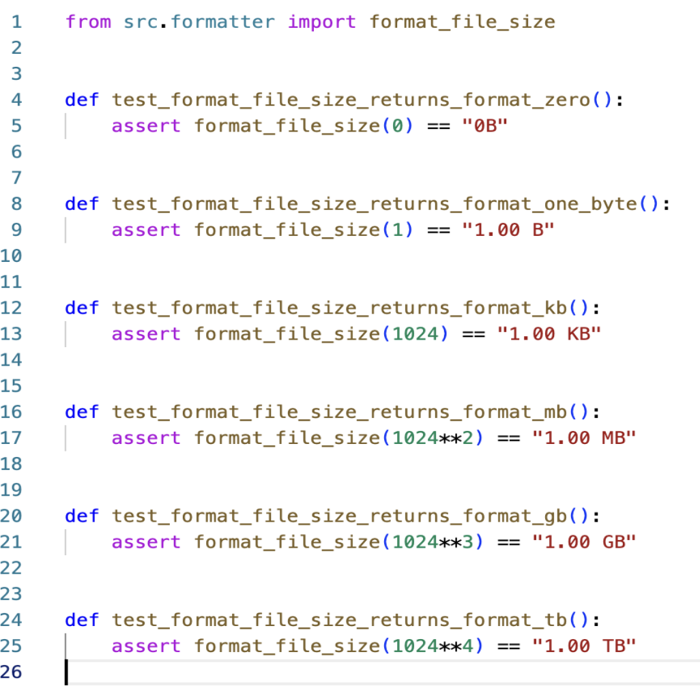

---

## 6. Parametrizing with Data Classes

An alternative to plain tuples is using Python data classes. They group inputs, expected outputs, and test IDs into a single named object — easier to read when cases get complex.

```python
from dataclasses import dataclass, field
import pytest
from src.formatter import format_file_size

@dataclass
class FileSizeTestCase:
    size_bytes: int
    expected_result: str
    id: str = field(init=False)
    expected_error: type[Exception] = None
    error_message: str | None = None

    def __post_init__(self):
        self.id = f"test_format_file_size_{self.size_bytes}_bytes"
```

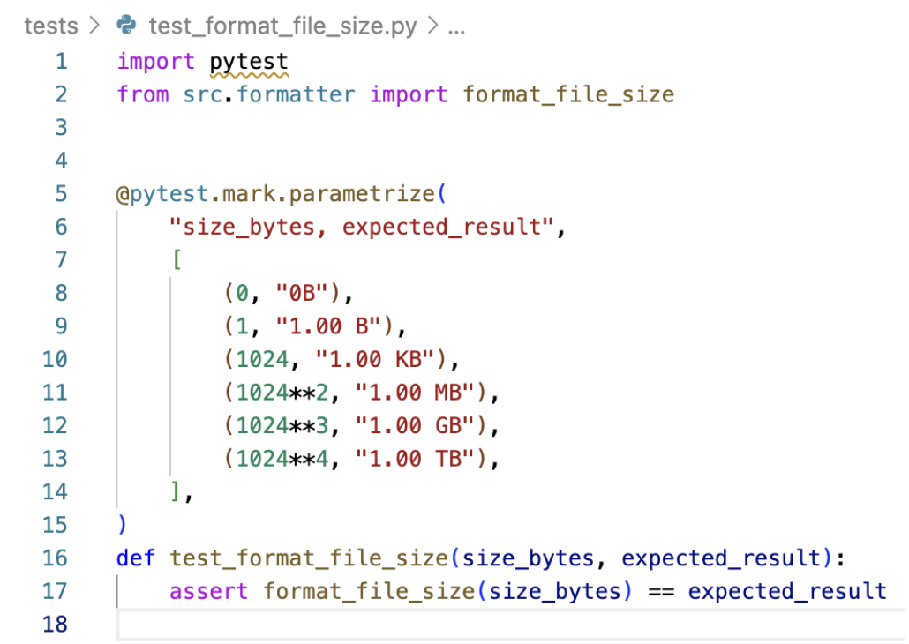

Each test case is then an instance of that class:

```python
test_cases = [
    FileSizeTestCase(0, "0B"),
    FileSizeTestCase(1, "1.00 B"),
    FileSizeTestCase(1024, "1.00 KB"),
    FileSizeTestCase(1024**2, "1.00 MB"),
    FileSizeTestCase(1024**3, "1.00 GB"),
    FileSizeTestCase(1024**4, "1.00 TB"),
]
```

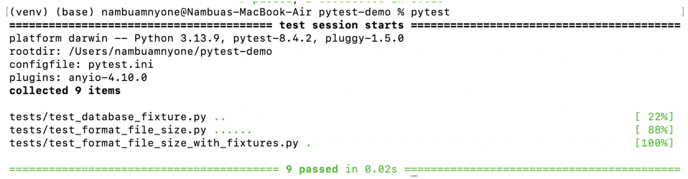

The `ids=lambda tc: tc.id` parameter passes custom names to each case, so the test output is readable at a glance:

```
tests/test_format_file_size.py::test_format_file_size[test_format_file_size_0_bytes] PASSED
tests/test_format_file_size.py::test_format_file_size[test_format_file_size_1_bytes] PASSED
tests/test_format_file_size.py::test_format_file_size[test_format_file_size_1024_bytes] PASSED
tests/test_format_file_size.py::test_format_file_size[test_format_file_size_1048576_bytes] PASSED
tests/test_format_file_size.py::test_format_file_size[test_format_file_size_1073741824_bytes] PASSED
tests/test_format_file_size.py::test_format_file_size[test_format_file_size_1099511627776_bytes] PASSED
```

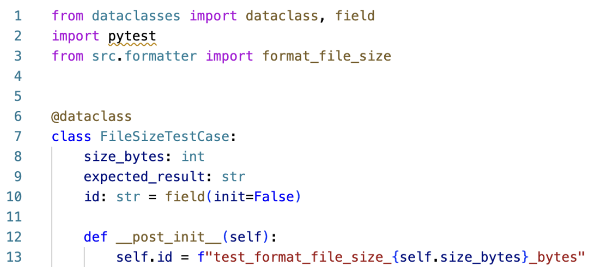

---

## 7. Testing Exception Handling

Some functions are supposed to raise exceptions under specific conditions. Pytest provides `pytest.raises()` to verify that behavior:

```python
def test_format_file_size_negative_size():
    with pytest.raises(ValueError, match="Size cannot be negative"):
        format_file_size(-1)
```

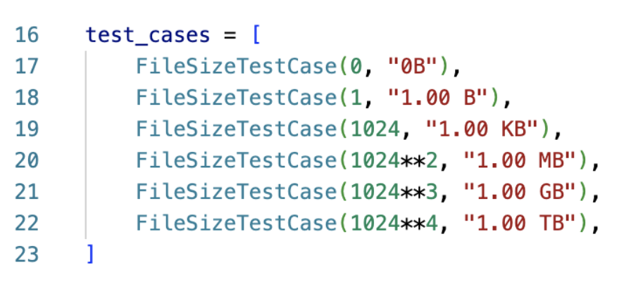

The `match` parameter checks that the exception message contains the expected string — confirming not just that an error was raised, but that it was the right error with the right message.

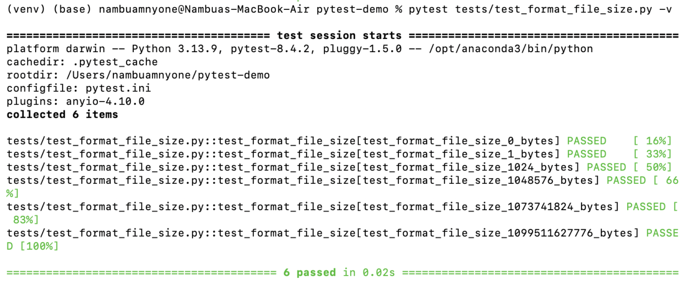

When using data classes, the same logic applies. The test function checks for `expected_error` and handles it through `pytest.raises()`:

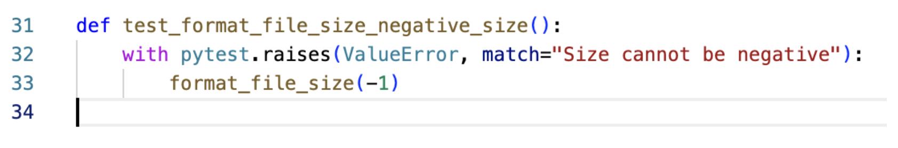

```python
@pytest.mark.parametrize("test_case", test_cases, ids=lambda tc: tc.id)
def test_format_file_size(test_case):
    if test_case.expected_error:
        with pytest.raises(test_case.expected_error, match=test_case.error_message):
            format_file_size(test_case.size_bytes)
    else:
        assert format_file_size(
            test_case.size_bytes) == test_case.expected_result
```

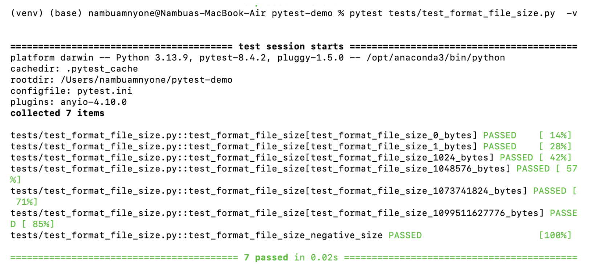

---

## 8. Fixtures

Fixtures are helper functions that Pytest runs before (or after) a test to set up the environment or provide data. They reduce repetition when multiple tests need the same starting conditions.

A simple fixture looks like this:

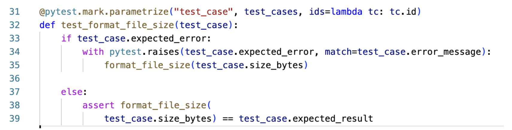

```python
import pytest

@pytest.fixture()
def welcome_message():
    """Return a welcome message."""
    return "Welcome to our application!"

def test_welcome_message(welcome_message):
    """Test if the fixture returns the correct welcome message."""
    assert welcome_message == "Welcome to our application!"
```

Pytest injects the fixture automatically when it sees a parameter name that matches a defined fixture.

### 8.1 Fixtures with Teardown

When a fixture creates a resource that needs to be cleaned up (like a database connection), teardown logic can be added using `request.addfinalizer()`:

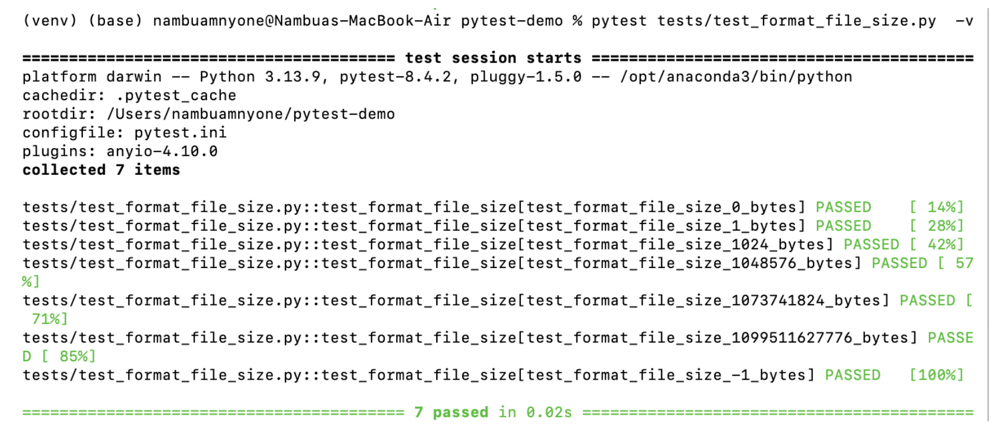

```python
@pytest.fixture(scope="module")
def db_connection(request):
    """Create a SQLite database connection for testing."""
    conn = sqlite3.connect(":memory:")
    c = conn.cursor()
    c.execute(
        """CREATE TABLE users
                (username TEXT, email TEXT)"""
    )
    conn.commit()

    def teardown():
        """Close the database connection after the test."""
        conn.close()

    request.addfinalizer(teardown)
    return conn
```

The `scope="module"` argument means this fixture is created once and shared across all tests in the module — as opposed to being recreated for each individual test. This is particularly useful when setup is expensive, like opening a real database connection.

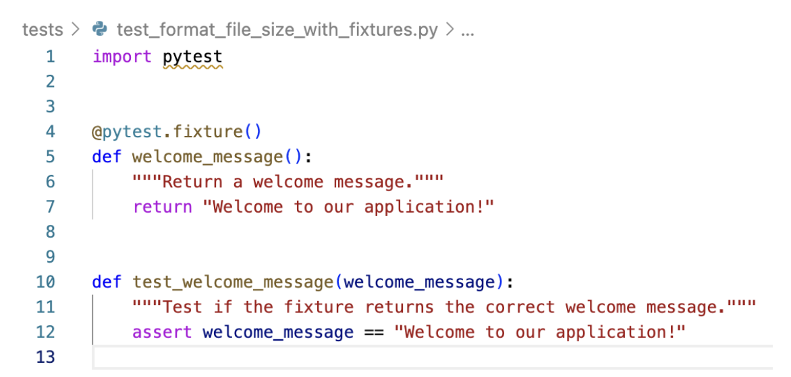

---

## 9. Extending Pytest with Plugins

One of Pytest's strengths is how far it can be extended without much extra code. The plugin ecosystem covers framework integrations, coverage reporting, parallel execution, and more. Installing a plugin is just a `pip install` away, and most hook into the existing `@pytest.mark` system so they feel native.

### 9.1 `pytest-timeout`

`pytest-timeout` lets you set a maximum execution time on individual tests. This is useful for catching tests that hang or call slow external services — problems that would otherwise silently block the entire test run.

```bash
pip install pytest-timeout
```

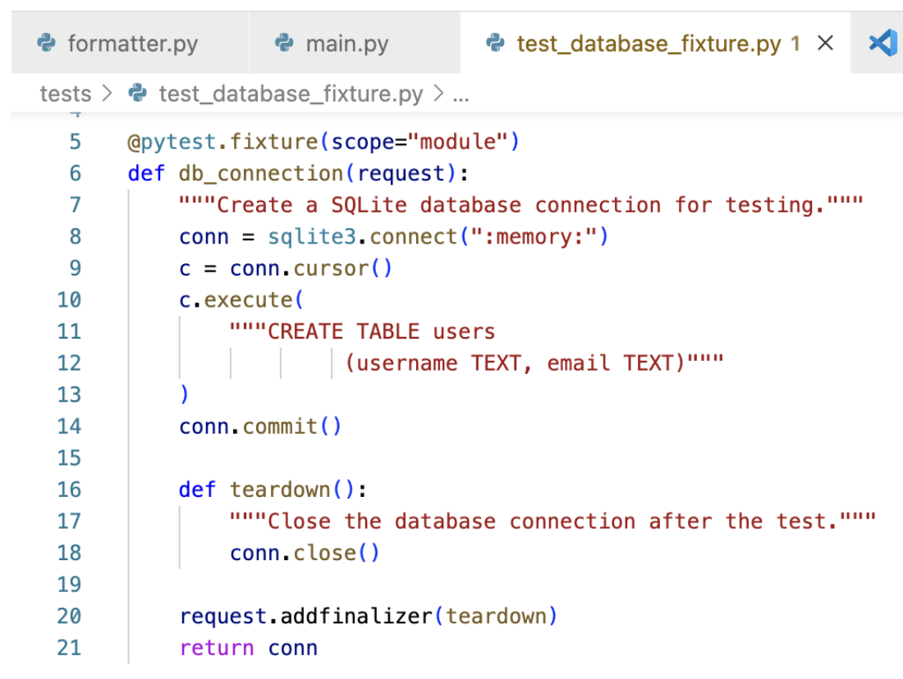

Apply the marker to any test:

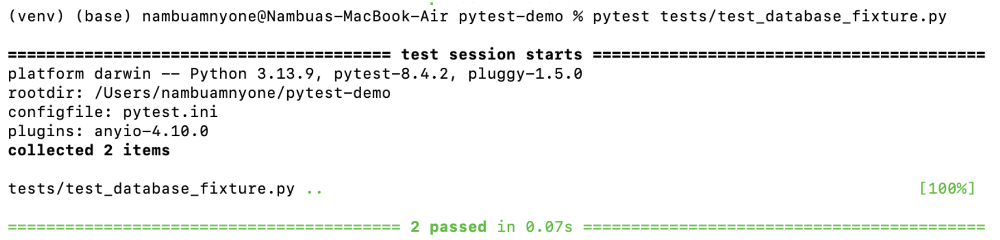

```python
import pytest
import time

@pytest.mark.timeout(5)  # passes — finishes in 3 seconds
def test_function_with_timeout():
    time.sleep(3)
    assert True


@pytest.mark.timeout(1)  # fails — takes 2 seconds, limit is 1
def test_function_exceeding_timeout():
    time.sleep(2)
    assert True
```

Running these produces one pass and one failure. The failure message `Timeout >1.0s` appears exactly where the hanging call is, making it easy to trace:

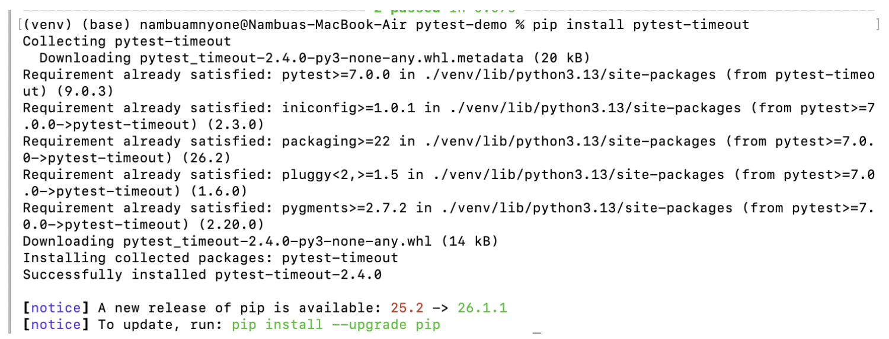

```
tests/test_with_timeout.py::test_function_with_timeout PASSED     [ 50%]
tests/test_with_timeout.py::test_function_exceeding_timeout FAILED [100%]

FAILURES
___________________________ test_function_exceeding_timeout ___________________________

    @pytest.mark.timeout(1)  # fails — takes 2 seconds, limit is 1
    def test_function_exceeding_timeout():
>       time.sleep(2)
E       Failed: Timeout (>1.0s) from pytest-timeout.

tests/test_with_timeout.py:12: Failed
1 failed, 1 passed in 4.07s
```
The time.sleep() calls here are stand-ins for whatever real logic you want to time-constrain.
Running these produces one pass and one failure:


The failure message Timeout >1.0s appears exactly where the hanging call is, which makes it
easy to trace.

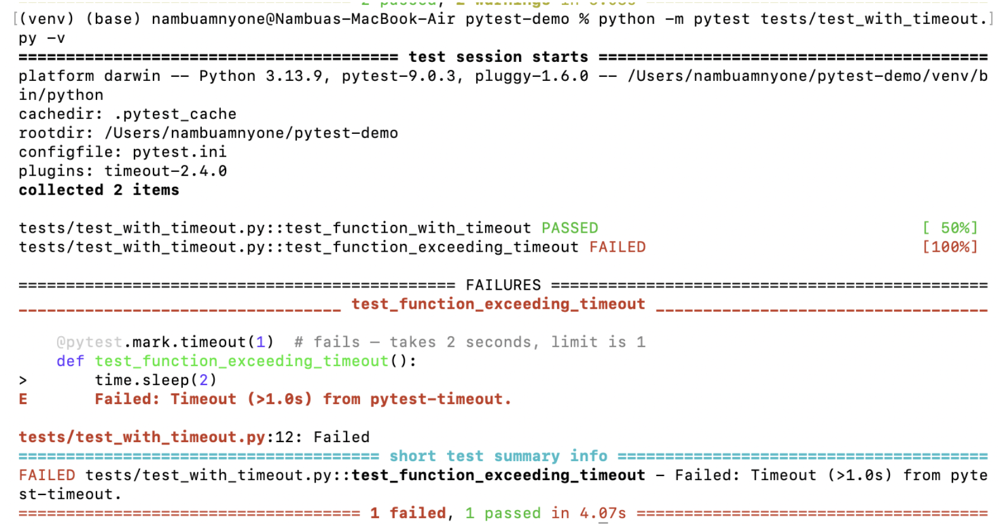
### 9.2 Other Useful Plugins

| Plugin | Purpose |
|---|---|
| **pytest-cov** | Reports which lines and branches of source code are exercised by tests. Start here — it highlights untested functions and code paths. |
| **pytest-xdist** | Runs tests in parallel across multiple CPU cores. Speeds up large test suites, provided tests don't share mutable state. |
| **pytest-django** / **pytest-flask** | Framework integrations for Django and Flask — database rollback between tests, test client utilities, request handling. |
| **pytest-docker** | Starts required Docker containers (databases, queues, services) before integration tests and shuts them down afterwards. |

---

## 10. Summary

| Concept | What it does |
|---|---|
| Naming conventions | `test_` prefix on files and functions lets Pytest discover tests automatically |
| `-k` filter / `::` selector | Run a targeted subset of tests during development |
| `@pytest.mark.parametrize` | Collapse repetitive test functions into one that handles multiple input/output pairs |
| Data classes | Cleaner parametrized cases when test inputs carry extra context (e.g., expected error types) |
| `pytest.raises()` | Verify that the right exception is raised with the right message |
| Fixtures | Centralize setup/teardown logic; use `scope="module"` to share expensive resources |
| Plugins | Extend Pytest via the marker system and CLI — no framework changes required |

Good tests are not just about covering cases — they should be readable enough that a failure message points directly to what broke and why. The plugin ecosystem is part of what makes Pytest scale from small scripts to full production projects.
